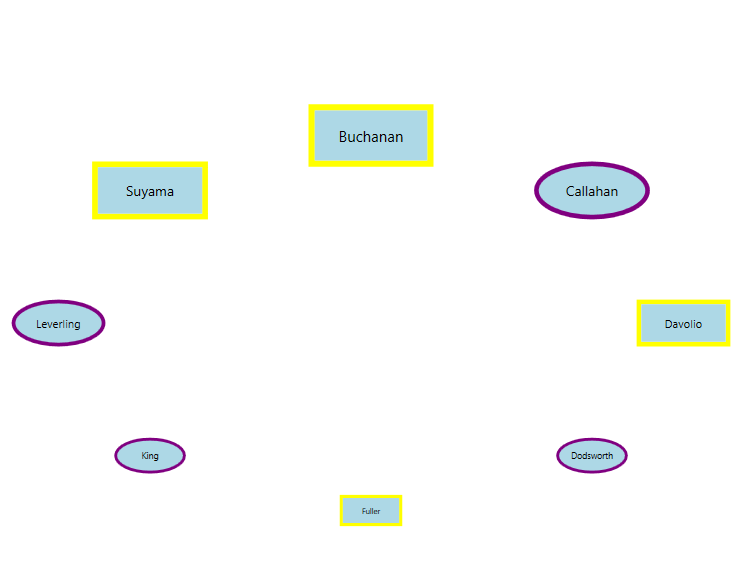

# Carousel control samples

This repository contains the samples that demonstrate the functionalities of Carousel.

<table>
 <tr>
  <td><a href="Samples/CarouselItem-Selection">Getting Started</a></td>
  <td><a href="Samples/CarouselItem-Selection">Populate Carousel Item</a></td>
  <td><a href="Samples/Binding">Binding Carousel items</a></td>
  <td><a href="Samples/StandardPath">Change item Radius</a></td>
  <td><a href="Samples/StandardPath">Rotation & Opacity support in Standard view</a> 
 </tr>
 <tr>
  <td><a href="Samples/StandardPath">Scaling & Skewing support in Standard view</a></td>
  <td><a href="Samples/CustomPath_customization">Scaling, Skewing, Opacity support for all items in custom view</a></td>
  <td><a href="Samples/CustomPath">Scaling, Skewing, Rotation & Opacity support for specific items in custom view</a></td>
  <td><a href="Samples/CustomPath">Item per page</a></td>
  <td><a href="Samples/Binding>Change Custom Path</a></td>
  <td><a href="Samples/ItemTemplate">Custom UI using Template</a></td>
 </tr>
 <tr>
  <td><a href="Samples/ItemContainerStyle">Custom UI using ItemContainerStyle</a></td>
  <td><a href="Samples/ItemContainerStyleSelector">Different Custom UI using Style Selector</a></td>
  <td><a href="Samples/Carousel-Scrolling">Navigate using Keyborad</a></td>
  <td><a href="Samples/Carousel-Scrolling">Navigate using commands</a></td>
  <td><a href="Samples/Carousel-Scrolling">Circular Scroll Support</a></td>
 </tr>
</table>

## Binding
To bind a collection to Carousel, use the ItemsSource property.
The user can create Rich Interface Applications by defining DataTemplate to a Carousel control.

## SelectedItem 
You can select a carousel item by mouse click on the specific item. You can get the selected item and its value by using the SelectedItem and SelectedValue properties. You can also get the selected item index by using the SelectedIndex property. You can only select a single item at a time.

## ItemContainerStyle
You can change the each carousel item appearance by using the ItemContainerStyle which is applied to the container element that generated for each carousel item. The default value of ItemContainerStyle is null. The DataContext of the ItemContainerStyle property is CarouselItem.

## ItemContainerStyleSelector
You can select a various custom appearance for the carousel items by using the ItemContainerStyleSelector property. The DataContext of the ItemContainerStyleSelector property is CarouselItem.

## Standard Path
You can load the carousel items in standard path by using the VisualMode property as VisualMode.Standard. The standard path of carousel items is a circular path. The default value of VisualMode property is VisualMode.Standard.

